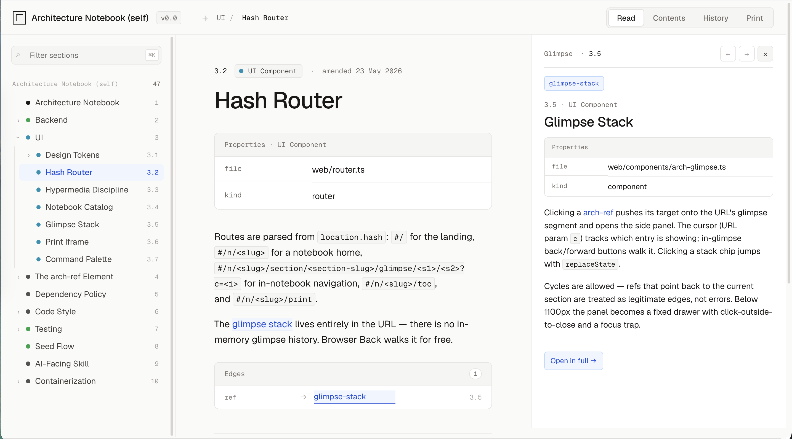

# Architecture Notebook

A local-first notebook for documenting system architectures — hierarchical sections, typed cross-references, per-type property schemas, revisions, and comments — served over a hypermedia HTTP API that an AI agent can drive end to end.

> **No authentication.** The server binds to `127.0.0.1` by default and ships no auth. Only expose it on a network you control — see [Running in a tailnet](#running-in-a-tailnet).

## What it is



Three surfaces over one SQLite-backed store:

1. **HAL+JSON HTTP API** — a discovery-driven REST API. A client that knows only `GET /api` can do everything: every legal link and write action is embedded in each response (`_links`, `_actions`, `_embedded`). Optimistic concurrency via ETags + `If-Match`, idempotent writes via `Idempotency-Key`, batch writes in a single SQLite transaction, RFC 7807 problem responses. Spec: [`design/api.md`](design/api.md).
2. **Web UI** — a [Lit](https://lit.dev) + signals single-page app (`web/`): notebook rendering, a graph of references, search, change history, and a print view.
3. **MCP server** — `/mcp/sse` + `/mcp/message`, exposing a `batch_api` tool so MCP clients can author notebooks directly.

The contract an AI agent loads to author a notebook is [`skill/SKILL.md`](skill/SKILL.md).

## Quickstart

Requires **Node 24+** (the server runs `.ts` directly via `--experimental-strip-types`; no build step) and **pnpm**.

```bash
pnpm install
pnpm dev          # server on 127.0.0.1, --watch; writes its URL to data/.port
pnpm dev:web      # esbuild watch: web/main.ts → web/dist/main.js (separate terminal)
```

Open the URL printed in `data/.port`. The server hosts a catalog of notebooks under `data/notebooks/`; create one from the landing page or via the API.

Or with Docker:

```bash
docker build -t architecture-notebook .
docker run --rm -p 8787:8787 -v "$PWD/data:/data" architecture-notebook
# → http://127.0.0.1:8787
```

Tests: `pnpm test` (unit + API), `pnpm test:integration` (builds the Docker image and exercises the running container).

## Architecture

- **Storage** — one SQLite database per notebook via `node:sqlite` (WAL mode, all writes in transactions). Schema migrations live in `server/migrations/`.
- **Server** — `node:http`, no framework. Routing is a lookup table; each route is its own module under `server/routes/`. Repositories own one table each; serializers build the HAL+JSON envelopes. **Zero runtime dependencies** — the server uses only `node:*` built-ins.
- **Web** — Lit components in `web/components/`, bundled by esbuild into `web/dist/main.js`. Browser dependencies: `lit`, `@lit-labs/signals`.
- **Tests** — `node:test` + `node:assert/strict`. Unit and API tests in `test/`; container integration tests in `test/integration/`.

```
server/        HTTP server, routes, repositories, migrations, MCP, batch engine
web/           Lit + signals single-page UI
skill/         AI-facing authoring contract (SKILL.md)
design/        API spec (api.md), visual mockup (mockup.html), UI screenshot
test/          node:test suites (unit, API, integration)
scripts/       build + seed helpers
Dockerfile     two-stage build → runtime image with no node_modules
```

## Running in a tailnet

The server has no auth, so a [Tailscale](https://tailscale.com) network is a natural home: the tailnet is the auth boundary, and a sidecar container terminates TLS. No host ports are published — the only ingress is HTTPS on the tailnet. Prerequisites: MagicDNS and [HTTPS certificates](https://tailscale.com/kb/1153/enabling-https) enabled on the tailnet.

`docker-compose.yml`:

```yaml
services:
  notebook-ts:
    image: tailscale/tailscale:latest
    hostname: notebook                      # becomes notebook.<your-tailnet>.ts.net
    restart: unless-stopped
    environment:
      - TS_AUTHKEY=${TS_AUTHKEY}            # pass via env; never commit a key
      - TS_SERVE_CONFIG=/config/serve.json
      - TS_STATE_DIR=/var/lib/tailscale
      - TS_USERSPACE=false
    volumes:
      - notebook-ts-state:/var/lib/tailscale
      - ./serve.json:/config/serve.json:ro
    devices:
      - /dev/net/tun:/dev/net/tun
    cap_add:
      - net_admin
      - sys_module

  notebook:
    build: .
    restart: unless-stopped
    network_mode: service:notebook-ts       # app shares the sidecar's network namespace
    environment:
      HOST: 127.0.0.1                       # loopback only; the sidecar's TLS proxy is the sole way in
      PORT: "8787"
      DATA_DIR: /data
    volumes:
      - ./data:/data                        # per-notebook SQLite files survive container recreates
    depends_on:
      notebook-ts:
        condition: service_started

volumes:
  notebook-ts-state:
```

`serve.json` (Tailscale terminates TLS on 443 and proxies to the app on loopback; `${TS_CERT_DOMAIN}` is substituted with the node's tailnet FQDN at startup, so this file works verbatim):

```json
{
  "TCP": { "443": { "HTTPS": true } },
  "Web": {
    "${TS_CERT_DOMAIN}:443": {
      "Handlers": { "/": { "Proxy": "http://127.0.0.1:8787" } }
    }
  }
}
```

Deploy and update:

```bash
git pull
docker compose build notebook
docker compose up -d notebook   # recreates the app; the sidecar keeps running
```

Use `docker compose stop` (not `down`) to halt the stack without touching volumes.

## License

[MIT](LICENSE) © Sammons Software LLC
